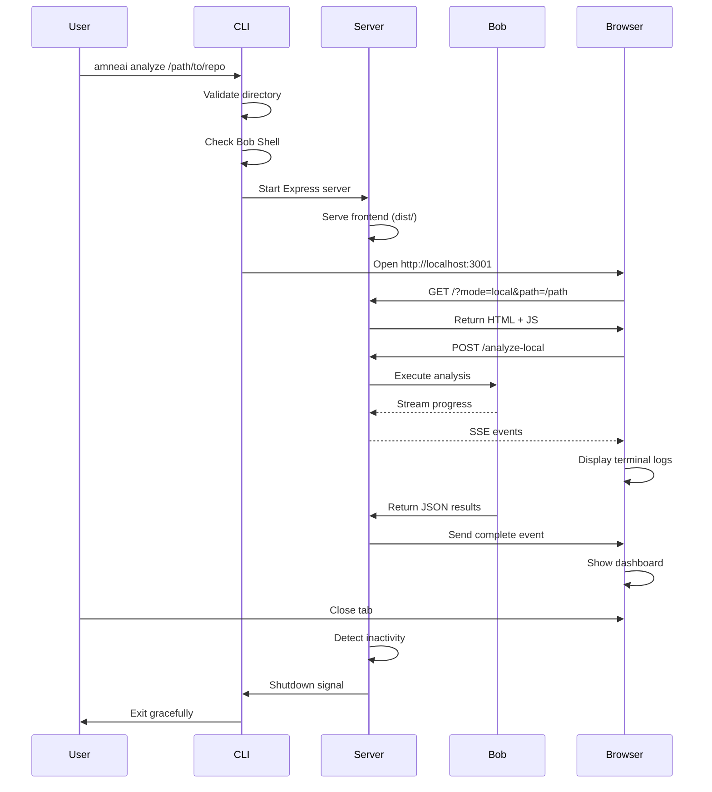

# Enterprise Mode Implementation Plan - CLI Tool with Web UI

**Project:** amneAI - AI-Powered Codebase Onboarding Tool  
**Feature:** Enterprise Mode (Local Bob Shell Execution)  
**Approach:** Option B - CLI Tool with Web UI  
**Date:** 2026-05-16

---

## Executive Summary

This plan details the implementation of **Enterprise Mode** for amneAI, enabling users to run Bob Shell locally for custom repository analysis without requiring the web interface. The chosen approach is **Option B: CLI Tool with Web UI** - a lightweight, npm-installable tool that spawns a local Express server and opens the browser automatically.

**Key Benefits:**
- ✅ Lightweight and easy to install (`npm install -g amneai`)
- ✅ Reuses existing backend code (minimal duplication)
- ✅ Familiar web UI experience
- ✅ No git clone needed (analyzes local directories directly)
- ✅ Cross-platform (Windows, Mac, Linux)

---

## 1. Architecture Design

### 1.1 High-Level Architecture

```
┌─────────────────────────────────────────────────────────────┐
│                    User Terminal                             │
│  $ amneai analyze /path/to/repo                             │
└─────────────────────────────────────────────────────────────┘
                            │
                            ▼
┌─────────────────────────────────────────────────────────────┐
│                    CLI Entry Point                           │
│  • Parse command-line arguments                             │
│  • Validate directory path                                  │
│  • Check Bob Shell availability                             │
└─────────────────────────────────────────────────────────────┘
                            │
                            ▼
┌─────────────────────────────────────────────────────────────┐
│              Local Express Server (Port 3001)               │
│  • Serves frontend build (dist/)                            │
│  • Provides /analyze-local endpoint                         │
│  • Handles local directory analysis                         │
│  • Streams Bob Shell output via SSE                         │
└─────────────────────────────────────────────────────────────┘
                            │
                            ▼
┌─────────────────────────────────────────────────────────────┐
│                  Bob Shell Analysis                          │
│  • Analyzes local directory (no git clone)                  │
│  • Streams progress to frontend                             │
│  • Returns structured JSON                                  │
└─────────────────────────────────────────────────────────────┘
                            │
                            ▼
┌─────────────────────────────────────────────────────────────┐
│              Browser Opens Automatically                     │
│  http://localhost:3001?mode=local&path=/path/to/repo       │
│  • Shows terminal display                                   │
│  • Real-time analysis progress                              │
│  • Interactive dashboard on completion                      │
└─────────────────────────────────────────────────────────────┘
```

### 1.2 Component Workflow

#### Step 1: CLI Initialization
```bash
$ amneai analyze /Users/randy/projects/my-app
```

#### Step 2: Validation & Setup
- Validate directory exists and is readable
- Check Bob Shell is installed (`bob --version`)
- Find available port (default 3001, fallback to 3002-3010)
- Initialize Express server with local mode

#### Step 3: Server Startup
- Serve pre-built frontend from `dist/` directory
- Create `/analyze-local` endpoint for local directory analysis
- Set up SSE streaming for real-time progress
- Inject query parameters: `?mode=local&path=/path/to/repo`

#### Step 4: Browser Launch
- Automatically open browser to `http://localhost:3001`
- Frontend detects `mode=local` query parameter
- Immediately starts analysis via `/analyze-local` endpoint

#### Step 5: Analysis Execution
- Bob Shell analyzes local directory (no git clone)
- Progress streams to frontend via SSE
- Terminal display shows real-time logs
- Results displayed in interactive dashboard

#### Step 6: Graceful Shutdown
- User closes browser tab
- Server detects inactivity (5 minute timeout)
- Automatic cleanup and shutdown
- OR: User presses Ctrl+C in terminal

### 1.3 Data Flow Diagram



---

## 2. File Structure

### 2.1 New Files to Create

```
amneai/
├── bin/
│   └── amneai.js                    # CLI entry point (executable)
├── src/
│   ├── cli/
│   │   ├── index.js                 # CLI logic and argument parsing
│   │   ├── server.js                # Local Express server
│   │   ├── validator.js             # Directory and Bob Shell validation
│   │   └── browser.js               # Browser launcher utility
│   ├── utils/
│   │   ├── localAnalyzer.js         # Local directory analysis (NEW)
│   │   └── portFinder.js            # Find available port (NEW)
│   └── (existing files...)
├── dist/                             # Pre-built frontend (from npm run build)
├── package.json                      # Updated with bin entry
└── README.md                         # Updated with CLI usage
```

### 2.2 Modified Files

**`package.json`**
```json
{
  "name": "amneai",
  "version": "1.0.0",
  "type": "module",
  "bin": {
    "amneai": "./bin/amneai.js"
  },
  "files": [
    "bin/",
    "dist/",
    "src/cli/",
    "src/utils/localAnalyzer.js",
    "src/utils/portFinder.js"
  ],
  "scripts": {
    "dev": "vite",
    "build": "vite build",
    "preview": "vite preview",
    "server": "node server.js",
    "dev:full": "concurrently \"npm run dev\" \"npm run server\"",
    "prepublishOnly": "npm run build"
  },
  "dependencies": {
    "@tailwindcss/postcss": "^4.3.0",
    "@vitejs/plugin-react": "^6.0.2",
    "autoprefixer": "^10.5.0",
    "commander": "^12.0.0",
    "cors": "^2.8.6",
    "express": "^5.2.1",
    "fs-extra": "^11.3.5",
    "lucide-react": "^1.16.0",
    "open": "^10.0.0",
    "postcss": "^8.5.14",
    "react": "^19.2.6",
    "react-dom": "^19.2.6",
    "tailwindcss": "^4.3.0",
    "vite": "^8.0.13"
  }
}
```

**`server.js`** (Existing file - add new endpoint)
- Add `/analyze-local` endpoint for local directory analysis
- Reuse existing Bob Shell integration logic
- Skip git clone step (analyze directory directly)

**`src/App.jsx`** (Existing file - add local mode detection)
- Detect `mode=local` query parameter
- Extract `path` from query parameters
- Call `/analyze-local` instead of `/analyze-stream`
- Display results normally

---

## 3. Installation & Usage

### 3.1 Global Installation

```bash
# Install globally from npm
npm install -g amneai

# Verify installation
amneai --version
# Output: amneai v1.0.0

# Check help
amneai --help
```

### 3.2 Command-Line Interface Design

#### Main Command
```bash
amneai analyze <directory> [options]
```

#### Options
```
-p, --port <number>      Port number (default: 3001)
-o, --open               Open browser automatically (default: true)
--no-open                Don't open browser
-v, --verbose            Verbose logging
-h, --help               Display help
--version                Display version
```

#### Examples

**Example 1: Analyze current directory**
```bash
amneai analyze .
```

**Example 2: Analyze specific directory**
```bash
amneai analyze /Users/randy/projects/my-app
```

**Example 3: Custom port**
```bash
amneai analyze ./my-repo --port 8080
```

**Example 4: Don't open browser**
```bash
amneai analyze ./my-repo --no-open
```

**Example 5: Verbose logging**
```bash
amneai analyze ./my-repo --verbose
```

### 3.3 Expected Terminal Output

```
╔═══════════════════════════════════════════════════════════╗
║                    amneAI CLI v1.0.0                      ║
╚═══════════════════════════════════════════════════════════╝

✓ Directory validated: /Users/randy/projects/my-app
✓ Bob Shell detected: v1.2.3
✓ Port 3001 available

Starting local server...
✓ Server running on http://localhost:3001

Opening browser...
✓ Browser opened successfully

Analyzing repository...
Press Ctrl+C to stop the server

[Server will auto-shutdown after 5 minutes of inactivity]
```

---

## 4. Local Directory Analysis

### 4.1 Key Differences from Git Clone Approach

| Aspect | Git Clone (Current) | Local Directory (New) |
|--------|---------------------|----------------------|
| **Input** | GitHub URL | Local file path |
| **Clone Step** | Required | Not needed |
| **Temp Directory** | Created | Not needed |
| **Cleanup** | Delete temp dir | No cleanup |
| **Speed** | Slower (clone time) | Faster (instant) |
| **Offline** | Requires internet | Works offline |

### 4.2 Implementation Strategy

**File: `src/utils/localAnalyzer.js`**

```javascript
import { exec } from 'child_process';
import { promisify } from 'util';
import path from 'path';
import fs from 'fs-extra';

const execPromise = promisify(exec);

/**
 * Analyze a local directory using Bob Shell
 * @param {string} dirPath - Absolute path to directory
 * @param {string} bobPrompt - Bob Shell prompt
 * @returns {Promise<Object>} - Analysis results
 */
export async function analyzeLocalDirectory(dirPath, bobPrompt) {
  // 1. Validate directory exists
  const exists = await fs.pathExists(dirPath);
  if (!exists) {
    throw new Error(`Directory not found: ${dirPath}`);
  }

  // 2. Check if directory is readable
  try {
    await fs.access(dirPath, fs.constants.R_OK);
  } catch (error) {
    throw new Error(`Directory not readable: ${dirPath}`);
  }

  // 3. Execute Bob Shell in the directory
  const { stdout, stderr } = await execPromise(
    `cd "${dirPath}" && bob -p "${bobPrompt.replace(/"/g, '\\"')}"`,
    {
      timeout: 300000, // 5 minute timeout
      maxBuffer: 10 * 1024 * 1024 // 10MB buffer
    }
  );

  if (stderr) {
    console.warn('Bob Shell stderr:', stderr);
  }

  // 4. Parse and return results
  return parseBobOutput(stdout);
}

/**
 * Stream Bob Shell analysis with progress updates
 * @param {string} dirPath - Absolute path to directory
 * @param {string} bobPrompt - Bob Shell prompt
 * @param {Function} onProgress - Progress callback
 * @returns {Promise<Object>} - Analysis results
 */
export async function analyzeLocalDirectoryStream(dirPath, bobPrompt, onProgress) {
  const { exec } = await import('child_process');
  
  return new Promise((resolve, reject) => {
    const bobProcess = exec(
      `cd "${dirPath}" && bob -p "${bobPrompt.replace(/"/g, '\\"')}"`,
      {
        timeout: 300000,
        maxBuffer: 10 * 1024 * 1024
      }
    );

    let bobOutput = '';

    bobProcess.stdout.on('data', (data) => {
      const output = data.toString();
      bobOutput += output;
      
      // Send progress updates
      if (onProgress) {
        onProgress(output);
      }
    });

    bobProcess.stderr.on('data', (data) => {
      const output = data.toString();
      if (!output.includes('warning') && onProgress) {
        onProgress(output, 'warning');
      }
    });

    bobProcess.on('close', (code) => {
      if (code === 0) {
        try {
          const analysis = parseBobOutput(bobOutput);
          resolve(analysis);
        } catch (error) {
          reject(error);
        }
      } else {
        reject(new Error(`Bob Shell failed with code ${code}`));
      }
    });

    bobProcess.on('error', reject);
  });
}
```

### 4.3 Integration with Existing Server

**File: `server.js`** (Add new endpoint)

```javascript
/**
 * POST /analyze-local
 * Analyze a local directory using Bob Shell
 */
app.post('/analyze-local', async (req, res) => {
  const { dirPath } = req.body;
  
  // Validate input
  if (!dirPath) {
    return res.status(400).json({ error: 'Directory path is required' });
  }
  
  // Set up SSE headers
  res.setHeader('Content-Type', 'text/event-stream');
  res.setHeader('Cache-Control', 'no-cache');
  res.setHeader('Connection', 'keep-alive');
  
  const sendEvent = (type, message) => {
    const eventData = {
      type,
      message,
      timestamp: new Date().toLocaleTimeString('en-US', { hour12: false })
    };
    res.write(`data: ${JSON.stringify(eventData)}\n\n`);
  };
  
  try {
    sendEvent('info', `Starting analysis for: ${dirPath}`);
    
    // Analyze local directory with streaming
    const analysis = await analyzeLocalDirectoryStream(
      dirPath,
      BOB_PROMPT,
      (output, type = 'info') => {
        const filteredMessage = filterBobShellOutput(output);
        if (filteredMessage) {
          sendEvent(type === 'warning' ? 'warning' : 'bob_thinking', 
                   `[Bob] ${filteredMessage}`);
        }
      }
    );
    
    // Add metadata
    if (!analysis.metadata) {
      analysis.metadata = {};
    }
    analysis.metadata.repoName = path.basename(dirPath);
    analysis.metadata.analyzedAt = new Date().toISOString();
    
    sendEvent('success', 'Analysis complete ✓');
    
    // Send final result
    res.write(`data: ${JSON.stringify({ type: 'complete', data: analysis })}\n\n`);
    res.end();
    
  } catch (error) {
    console.error('Error analyzing local directory:', error);
    sendEvent('error', error.message);
    res.write(`data: ${JSON.stringify({ type: 'error', message: error.message })}\n\n`);
    res.end();
  }
});
```

---

## 5. User Experience Flow

### 5.1 Step-by-Step User Journey

#### Phase 1: Installation (One-time)
```
User Action: npm install -g amneai
Expected Time: 30-60 seconds
Output: 
  ✓ amneai@1.0.0 installed globally
  ✓ Run 'amneai --help' to get started
```

#### Phase 2: First Run
```
User Action: amneai analyze /path/to/repo
Expected Time: 2-3 seconds (startup)
Output:
  ✓ Directory validated
  ✓ Bob Shell detected
  ✓ Server starting...
  ✓ Browser opening...
```

#### Phase 3: Analysis
```
Browser Opens: http://localhost:3001?mode=local&path=/path/to/repo
Expected Time: 30-120 seconds (depending on repo size)
Display:
  - Terminal-style interface
  - Real-time progress logs
  - Bob's thinking process
  - Completion message
```

#### Phase 4: Results
```
User Action: Click "Show Analysis" button
Expected Time: Instant
Display:
  - Interactive dashboard
  - 7 analysis cards
  - GitHub link (if available)
  - "Back to Terminal" button
```

#### Phase 5: Shutdown
```
User Action: Close browser tab OR Ctrl+C in terminal
Expected Time: Instant
Output:
  ✓ Server shutting down gracefully
  ✓ Cleanup complete
```

### 5.2 Terminal Output Examples

**Success Case:**
```
╔═══════════════════════════════════════════════════════════╗
║                    amneAI CLI v1.0.0                      ║
╚═══════════════════════════════════════════════════════════╝

✓ Directory validated: /Users/randy/projects/my-app
✓ Bob Shell detected: v1.2.3
✓ Port 3001 available

Starting local server...
✓ Server running on http://localhost:3001

Opening browser...
✓ Browser opened successfully

Analyzing repository...
[18:45:21] Starting analysis...
[18:45:22] [Bob] Reading package.json
[18:45:23] [Bob] Analyzing React components
[18:45:25] [Bob] Examining API routes
[18:45:28] Analysis complete ✓

Press Ctrl+C to stop the server
[Server will auto-shutdown after 5 minutes of inactivity]
```

**Error Case (Bob Shell not found):**
```
╔═══════════════════════════════════════════════════════════╗
║                    amneAI CLI v1.0.0                      ║
╚═══════════════════════════════════════════════════════════╝

✗ Bob Shell not found

Please install Bob Shell first:
  https://github.com/IBM/bob-shell

Or check if 'bob' is in your PATH:
  echo $PATH

Exiting...
```

**Error Case (Invalid directory):**
```
╔═══════════════════════════════════════════════════════════╗
║                    amneAI CLI v1.0.0                      ║
╚═══════════════════════════════════════════════════════════╝

✗ Directory not found: /invalid/path

Please provide a valid directory path:
  amneai analyze /path/to/repo

Exiting...
```

### 5.3 Browser Interaction

**Initial Load:**
```
URL: http://localhost:3001?mode=local&path=/Users/randy/projects/my-app

Display:
┌─────────────────────────────────────────────────────────┐
│ ● ● ●  amneAI Terminal                                  │
├─────────────────────────────────────────────────────────┤
│ [18:45:21] Starting analysis...                         │
│ [18:45:22] [Bob] Reading package.json                   │
│ [18:45:23] [Bob] Analyzing React components             │
│ [18:45:25] [Bob] Examining API routes                   │
│ [18:45:28] Analysis complete ✓                          │
│                                                          │
│ [Show Analysis Button]                                  │
└─────────────────────────────────────────────────────────┘
```

**After Clicking "Show Analysis":**
```
Display: Interactive dashboard with 7 cards
- Summary Card
- Architecture Card
- Data Flow Card
- Key Files Card
- Entry Points Card
- Gotchas Card
- Dependencies Card

[Back to Terminal] button in header
```

---

## 6. Edge Cases & Error Handling

### 6.1 Directory Validation

| Error Case | Detection | User Message | Recovery |
|------------|-----------|--------------|----------|
| Directory doesn't exist | `fs.pathExists()` | "Directory not found: {path}" | Exit with code 1 |
| No read permissions | `fs.access()` | "Directory not readable: {path}" | Exit with code 1 |
| Empty directory | File count check | "Directory is empty" | Continue with warning |
| Not a code repository | No config files | "No package.json, requirements.txt, etc. found" | Continue anyway |

### 6.2 Bob Shell Issues

| Error Case | Detection | User Message | Recovery |
|------------|-----------|--------------|----------|
| Bob not installed | `bob --version` fails | "Bob Shell not found. Install from: {url}" | Exit with code 1 |
| Bob execution fails | Exit code != 0 | "Bob Shell analysis failed: {error}" | Show error in browser |
| Bob timeout | 5 minute timeout | "Analysis timeout - repository too large" | Show partial results |
| Invalid JSON output | Parse error | "Failed to parse Bob output" | Show raw output |

### 6.3 Port Conflicts

| Error Case | Detection | User Message | Recovery |
|------------|-----------|--------------|----------|
| Port 3001 in use | `EADDRINUSE` error | "Port 3001 in use, trying 3002..." | Try ports 3002-3010 |
| All ports in use | All attempts fail | "No available ports (3001-3010)" | Exit with code 1 |
| Port specified by user | `--port` flag | Use specified port | Fail if unavailable |

### 6.4 Browser Launch Issues

| Error Case | Detection | User Message | Recovery |
|------------|-----------|--------------|----------|
| Browser not found | `open` package error | "Could not open browser. Visit: {url}" | Continue (show URL) |
| Browser fails to open | Timeout | "Browser didn't open. Visit: {url}" | Continue (show URL) |
| User closes immediately | Connection lost | "Browser closed. Server still running." | Continue serving |

### 6.5 Analysis Errors

| Error Case | Detection | User Message | Recovery |
|------------|-----------|--------------|----------|
| Large repository | File count > 10,000 | "Large repository detected. This may take a while." | Continue with warning |
| Binary files | Bob encounters binary | "Skipping binary files..." | Continue |
| Permission errors | File access denied | "Skipped files due to permissions" | Continue with warning |
| Network issues (git) | Git operations fail | "Git operations failed (offline?)" | Continue without git info |

### 6.6 Graceful Shutdown

| Trigger | Detection | Action | Cleanup |
|---------|-----------|--------|---------|
| Ctrl+C in terminal | SIGINT signal | Show "Shutting down..." | Close server, exit |
| Browser closed | No connections for 5 min | Auto-shutdown | Close server, exit |
| Server error | Uncaught exception | Show error, shutdown | Close server, exit |
| User kills process | SIGTERM signal | Immediate shutdown | Best-effort cleanup |

### 6.7 Error Handling Implementation

**File: `src/cli/validator.js`**

```javascript
import fs from 'fs-extra';
import { exec } from 'child_process';
import { promisify } from 'util';

const execPromise = promisify(exec);

export class ValidationError extends Error {
  constructor(message, code) {
    super(message);
    this.name = 'ValidationError';
    this.code = code;
  }
}

/**
 * Validate directory exists and is readable
 */
export async function validateDirectory(dirPath) {
  // Check existence
  const exists = await fs.pathExists(dirPath);
  if (!exists) {
    throw new ValidationError(
      `Directory not found: ${dirPath}`,
      'DIR_NOT_FOUND'
    );
  }

  // Check read permissions
  try {
    await fs.access(dirPath, fs.constants.R_OK);
  } catch (error) {
    throw new ValidationError(
      `Directory not readable: ${dirPath}`,
      'DIR_NOT_READABLE'
    );
  }

  // Check if empty (warning only)
  const files = await fs.readdir(dirPath);
  if (files.length === 0) {
    console.warn('⚠ Warning: Directory is empty');
  }

  return true;
}

/**
 * Check if Bob Shell is installed
 */
export async function validateBobShell() {
  try {
    const { stdout } = await execPromise('bob --version');
    const version = stdout.trim();
    console.log(`✓ Bob Shell detected: ${version}`);
    return version;
  } catch (error) {
    throw new ValidationError(
      'Bob Shell not found. Install from: https://github.com/IBM/bob-shell',
      'BOB_NOT_FOUND'
    );
  }
}

/**
 * Find available port
 */
export async function findAvailablePort(startPort = 3001, maxAttempts = 10) {
  const net = await import('net');
  
  for (let i = 0; i < maxAttempts; i++) {
    const port = startPort + i;
    
    try {
      await new Promise((resolve, reject) => {
        const server = net.createServer();
        server.once('error', reject);
        server.once('listening', () => {
          server.close();
          resolve();
        });
        server.listen(port);
      });
      
      return port;
    } catch (error) {
      if (i === maxAttempts - 1) {
        throw new ValidationError(
          `No available ports (${startPort}-${startPort + maxAttempts - 1})`,
          'NO_AVAILABLE_PORT'
        );
      }
      console.log(`Port ${port} in use, trying ${port + 1}...`);
    }
  }
}
```

---

## 7. Documentation Requirements

### 7.1 Installation Guide

**File: `docs/INSTALLATION.md`**

```markdown
# Installation Guide

## Prerequisites

- Node.js 18 or higher
- npm or yarn
- Bob Shell (for analysis)

## Installing Bob Shell

Bob Shell is part of IBM's BOB IDE and must be downloaded from the official IBM website.

### All Platforms (macOS, Linux, Windows)

1. **Visit the official download page:**
   ```
   https://bob.ibm.com/download?bob=shell
   ```

2. **Download the installer for your platform:**
   - macOS: Download `.dmg` or `.pkg` installer
   - Linux: Download `.deb`, `.rpm`, or `.tar.gz` package
   - Windows: Download `.exe` or `.msi` installer

3. **Run the installer:**
   - Follow the on-screen installation instructions
   - The installer will add `bob` to your system PATH

4. **Verify Installation:**
   ```bash
   bob --version
   # Should output: bob v1.2.3 (or similar)
   ```

### Alternative: Manual Installation

If you prefer manual installation or the installer doesn't work:

1. Download the appropriate package from https://bob.ibm.com/download?bob=shell
2. Extract to a directory (e.g., `/usr/local/bob` or `C:\Program Files\Bob`)
3. Add the `bin` directory to your PATH:
   
   **macOS/Linux:**
   ```bash
   # Add to ~/.bashrc or ~/.zshrc
   export PATH="/usr/local/bob/bin:$PATH"
   
   # Reload shell configuration
   source ~/.bashrc  # or source ~/.zshrc
   ```
   
   **Windows:**
   ```powershell
   # Add to System Environment Variables
   # Control Panel → System → Advanced → Environment Variables
   # Add C:\Program Files\Bob\bin to PATH
   ```

4. Verify installation:
   ```bash
   bob --version
   ```

### Troubleshooting Bob Shell Installation

**Issue: "bob: command not found"**
- Ensure Bob Shell is properly installed from https://bob.ibm.com/download?bob=shell
- Check that the installation directory is in your PATH
- Restart your terminal/command prompt
- Try running with full path: `/usr/local/bob/bin/bob --version`

**Issue: Permission denied**
- On macOS/Linux, you may need to make the binary executable:
  ```bash
  chmod +x /usr/local/bob/bin/bob
  ```

**Issue: Installation fails**
- Check system requirements on https://bob.ibm.com/download?bob=shell
- Ensure you have administrator/sudo privileges
- Check available disk space
- Try downloading again (file may be corrupted)

### System Requirements for Bob Shell

- **Operating System:** macOS 10.15+, Linux (Ubuntu 20.04+, RHEL 8+), Windows 10+
- **Memory:** 4GB RAM minimum, 8GB recommended
- **Disk Space:** 500MB for Bob Shell installation
- **Network:** Internet connection for initial download only

## Installing amneAI

### Global Installation (Recommended)
```bash
npm install -g amneai
```

### Local Installation
```bash
npm install amneai
npx amneai analyze /path/to/repo
```

### From Source
```bash
git clone https://github.com/ranfarrr/amneai
cd amneai
npm install
npm run build
npm link
```

## Verification

```bash
# Check amneAI version
amneai --version

# Check help
amneai --help

# Test with current directory
amneai analyze .
```

## Troubleshooting

### "Bob Shell not found"
- Ensure Bob Shell is installed from https://bob.ibm.com/download?bob=shell
- Check installation: `bob --version`
- Check PATH: `echo $PATH`
- Add Bob to PATH if needed (see installation guide above)

### "Port 3001 in use"
- Use custom port: `amneai analyze . --port 8080`
- Kill existing process: `lsof -ti:3001 | xargs kill`

### "Directory not readable"
- Check permissions: `ls -la /path/to/repo`
- Run with sudo (not recommended): `sudo amneai analyze /path`
```

### 7.2 Usage Examples

**File: `docs/USAGE.md`**

```markdown
# Usage Guide

## Basic Usage

### Analyze Current Directory
```bash
amneai analyze .
```

### Analyze Specific Directory
```bash
amneai analyze /Users/randy/projects/my-app
```

### Analyze with Relative Path
```bash
amneai analyze ../other-project
```

## Advanced Usage

### Custom Port
```bash
amneai analyze . --port 8080
```

### Don't Open Browser
```bash
amneai analyze . --no-open
# Then manually visit: http://localhost:3001
```

### Verbose Logging
```bash
amneai analyze . --verbose
```

### Combine Options
```bash
amneai analyze /path/to/repo --port 8080 --verbose --no-open
```

## Common Workflows

### Workflow 1: Quick Analysis
```bash
cd /path/to/repo
amneai analyze .
# Browser opens automatically
# View results
# Close browser when done
```

### Workflow 2: Multiple Repositories
```bash
# Terminal 1
amneai analyze /path/to/repo1 --port 3001

# Terminal 2
amneai analyze /path/to/repo2 --port 3002

# Terminal 3
amneai analyze /path/to/repo3 --port 3003
```

### Workflow 3: CI/CD Integration
```bash
# Generate analysis report
amneai analyze . --no-open > analysis.log

# Check if analysis succeeded
if [ $? -eq 0 ]; then
  echo "Analysis successful"
else
  echo "Analysis failed"
  exit 1
fi
```

## Tips & Tricks

### Tip 1: Alias for Quick Access
```bash
# Add to ~/.bashrc or ~/.zshrc
alias analyze='amneai analyze'

# Usage
analyze .
```

### Tip 2: Analyze Git Repositories
```bash
# Clone and analyze in one go
git clone https://github.com/user/repo && cd repo && amneai analyze .
```

### Tip 3: Save Analysis Results
```bash
# The analysis is available at http://localhost:3001
# Use browser's "Save Page As" to save results
```

### Tip 4: Share Analysis
```bash
# Keep server running and share URL
amneai analyze . --no-open
# Share: http://your-ip:3001 (on local network)
```
```

### 7.3 Troubleshooting Section

**File: `docs/TROUBLESHOOTING.md`**

```markdown
# Troubleshooting Guide

## Common Issues

### Issue 1: "Bob Shell not found"

**Symptoms:**
```
✗ Bob Shell not found
```

**Solutions:**
1. Install Bob Shell:
   ```bash
   npm install -g @ibm/bob-shell
   ```

2. Verify installation:
   ```bash
   bob --version
   ```

3. Check PATH:
   ```bash
   echo $PATH
   which bob
   ```

4. Reinstall if needed:
   ```bash
   npm uninstall -g @ibm/bob-shell
   npm install -g @ibm/bob-shell
   ```

### Issue 2: "Port 3001 in use"

**Symptoms:**
```
✗ Port 3001 in use, trying 3002...
✗ Port 3002 in use, trying 3003...
```

**Solutions:**
1. Use custom port:
   ```bash
   amneai analyze . --port 8080
   ```

2. Kill existing process:
   ```bash
   # macOS/Linux
   lsof -ti:3001 | xargs kill
   
   # Windows
   netstat -ano | findstr :3001
   taskkill /PID <PID> /F
   ```

3. Wait for auto-shutdown (5 minutes)

### Issue 3: "Directory not readable"

**Symptoms:**
```
✗ Directory not readable: /path/to/repo
```

**Solutions:**
1. Check permissions:
   ```bash
   ls -la /path/to/repo
   ```

2. Fix permissions:
   ```bash
   chmod -R u+r /path/to/repo
   ```

3. Run as owner:
   ```bash
   sudo -u owner amneai analyze /path/to/repo
   ```

### Issue 4: "Browser didn't open"

**Symptoms:**
```
✗ Could not open browser
Visit: http://localhost:3001
```

**Solutions:**
1. Manually open browser:
   - Visit http://localhost:3001

2. Check default browser:
   ```bash
   # macOS
   open http://localhost:3001
   
   # Linux
   xdg-open http://localhost:3001
   
   # Windows
   start http://localhost:3001
   ```

3. Use --no-open flag:
   ```bash
   amneai analyze . --no-open
   ```

### Issue 5: "Analysis timeout"

**Symptoms:**
```
✗ Analysis timeout - repository too large
```

**Solutions:**
1. Analyze smaller subdirectory:
   ```bash
   amneai analyze ./src
   ```

2. Exclude large directories:
   - Add `.bobignore` file (similar to `.gitignore`)

3. Increase timeout (future feature):
   ```bash
   amneai analyze . --timeout 600
   ```

### Issue 6: "Failed to parse Bob output"

**Symptoms:**
```
✗ Failed to parse analysis results
```

**Solutions:**
1. Check Bob Shell version:
   ```bash
   bob --version
   # Should be v1.2.0 or higher
   ```

2. Update Bob Shell:
   - Visit https://bob.ibm.com/download?bob=shell
   - Download and install the latest version

3. Run with verbose logging:
   ```bash
   amneai analyze . --verbose
   ```

4. Report issue with logs

## Performance Issues

### Slow Analysis

**Causes:**
- Large repository (>10,000 files)
- Many dependencies
- Complex codebase

**Solutions:**
1. Analyze specific subdirectory
2. Exclude node_modules, dist, build
3. Use faster machine
4. Close other applications

### High Memory Usage

**Causes:**
- Very large files
- Many concurrent analyses

**Solutions:**
1. Analyze one repository at a time
2. Close other applications
3. Increase Node.js memory:
   ```bash
   NODE_OPTIONS="--max-old-space-size=4096" amneai analyze .
   ```

## Getting Help

### Check Logs
```bash
# Verbose mode
amneai analyze . --verbose

# Check system logs
# macOS/Linux: ~/.amneai/logs/
# Windows: %APPDATA%\amneai\logs\
```

### Report Issues
1. Visit: https://github.com/ranfarrr/amneai/issues
2. Include:
   - amneAI version: `amneai --version`
   - Bob Shell version: `bob --version`
   - Node.js version: `node --version`
   - Operating system
   - Error message
   - Steps to reproduce

### Community Support
- GitHub Discussions: https://github.com/ranfarrr/amneai/discussions
- Discord: [Link to Discord]
- Email: support@amneai.com
```

---

## 8. Implementation Checklist

### Phase 1: Core CLI Infrastructure (Week 1)

- [ ] Create `bin/amneai.js` executable entry point
- [ ] Implement `src/cli/index.js` with Commander.js
- [ ] Create `src/cli/validator.js` for validation logic
- [ ] Implement `src/utils/portFinder.js` for port detection
- [ ] Create `src/cli/browser.js` for browser launching
- [ ] Update `package.json` with bin entry and dependencies
- [ ] Test CLI installation locally (`npm link`)

### Phase 2: Local Analysis Engine (Week 1-2)

- [ ] Create `src/utils/localAnalyzer.js`
- [ ] Implement `analyzeLocalDirectory()` function
- [ ] Implement `analyzeLocalDirectoryStream()` for SSE
- [ ] Add `/analyze-local` endpoint to `server.js`
- [ ] Test local directory analysis (no git clone)
- [ ] Verify Bob Shell integration works

### Phase 3: Server & Frontend Integration (Week 2)

- [ ] Create `src/cli/server.js` for local Express server
- [ ] Implement static file serving from `dist/`
- [ ] Add query parameter detection in `src/App.jsx`
- [ ] Implement local mode UI flow
- [ ] Test browser auto-launch
- [ ] Verify SSE streaming works

### Phase 4: Error Handling & Edge Cases (Week 2-3)

- [ ] Implement directory validation
- [ ] Add Bob Shell detection
- [ ] Handle port conflicts
- [ ] Implement graceful shutdown
- [ ] Add timeout handling
- [ ] Test all error scenarios

### Phase 5: Documentation (Week 3)

- [ ] Write `docs/INSTALLATION.md`
- [ ] Write `docs/USAGE.md`
- [ ] Write `docs/TROUBLESHOOTING.md`
- [ ] Update main `README.md`
- [ ] Create demo video
- [ ] Add screenshots

### Phase 6: Testing & Polish (Week 3-4)

- [ ] Test on macOS
- [ ] Test on Linux
- [ ] Test on Windows
- [ ] Test with various repository types
- [ ] Performance testing
- [ ] User acceptance testing

### Phase 7: Publishing (Week 4)

- [ ] Create npm account (if needed)
- [ ] Publish to npm registry
- [ ] Create GitHub release
- [ ] Announce on social media
- [ ] Submit to hackathon

---

## 9. Success Metrics

### Technical Metrics

- **Installation Time:** < 60 seconds
- **Startup Time:** < 3 seconds
- **Analysis Time:** 30-120 seconds (depending on repo size)
- **Memory Usage:** < 500MB
- **CPU Usage:** < 50% during analysis
- **Error Rate:** < 5% of analyses

### User Experience Metrics

- **Time to First Analysis:** < 2 minutes (including installation)
- **User Satisfaction:** > 4.5/5 stars
- **Documentation Clarity:** > 90% users understand without help
- **Support Requests:** < 10% of users need help

### Adoption Metrics

- **npm Downloads:** Target 1,000+ in first month
- **GitHub Stars:** Target 100+ in first month
- **Active Users:** Target 500+ in first month
- **Community Contributions:** Target 5+ PRs in first month

---

## 10. Future Enhancements

### Phase 2 Features (Post-Launch)

1. **Configuration File Support**
   - `.amneairc` file for custom settings
   - Ignore patterns (like `.gitignore`)
   - Custom Bob Shell prompts

2. **Export Formats**
   - PDF export
   - Markdown export
   - JSON export
   - HTML export (standalone)

3. **Team Features**
   - Share analysis via URL
   - Collaborative annotations
   - Team workspaces

4. **Advanced Analysis**
   - Security vulnerability detection
   - Code quality metrics
   - Performance analysis
   - Dependency graph visualization

5. **IDE Integrations**
   - VS Code extension
   - JetBrains plugin
   - Sublime Text plugin

6. **CI/CD Integration**
   - GitHub Actions
   - GitLab CI
   - Jenkins plugin
   - CircleCI orb

---

## 11. Risk Assessment

### High Risk Items

| Risk | Impact | Probability | Mitigation |
|------|--------|-------------|------------|
| Bob Shell API changes | High | Medium | Version pinning, compatibility layer |
| npm package name conflict | High | Low | Check availability early |
| Cross-platform issues | Medium | High | Test on all platforms early |
| Performance on large repos | Medium | Medium | Add timeout, progress indicators |

### Medium Risk Items

| Risk | Impact | Probability | Mitigation |
|------|--------|-------------|------------|
| Browser launch failures | Medium | Medium | Fallback to manual URL |
| Port conflicts | Low | High | Auto-find available port |
| Permission issues | Medium | Low | Clear error messages |
| Network issues (offline) | Low | Medium | Works offline by design |

### Low Risk Items

| Risk | Impact | Probability | Mitigation |
|------|--------|-------------|------------|
| Documentation gaps | Low | Medium | User feedback, iterations |
| UI/UX issues | Low | Low | User testing |
| Minor bugs | Low | High | Thorough testing, quick fixes |

---

## 12. Timeline

### Week 1: Foundation
- Days 1-2: CLI infrastructure
- Days 3-4: Local analysis engine
- Days 5-7: Testing and debugging

### Week 2: Integration
- Days 1-3: Server and frontend integration
- Days 4-5: Error handling
- Days 6-7: Testing

### Week 3: Documentation & Testing
- Days 1-2: Documentation
- Days 3-5: Cross-platform testing
- Days 6-7: User acceptance testing

### Week 4: Launch
- Days 1-2: Final polish
- Days 3-4: npm publishing
- Days 5-7: Marketing and support

**Total Timeline:** 4 weeks (28 days)

---

## 13. Conclusion

This implementation plan provides a comprehensive roadmap for building Enterprise Mode as a CLI tool with web UI. The approach balances:

- **Simplicity:** Easy to install and use
- **Reusability:** Leverages existing backend code
- **User Experience:** Familiar web interface
- **Performance:** Fast local analysis
- **Reliability:** Robust error handling

**Next Steps:**
1. Review and approve this plan
2. Set up development environment
3. Begin Phase 1 implementation
4. Regular progress reviews

**Questions or Concerns:**
- Reach out to project maintainer
- Open GitHub discussion
- Schedule planning meeting

---

**Document Version:** 1.0  
**Last Updated:** 2026-05-16  
**Author:** Bob (AI Planning Assistant)  
**Status:** Ready for Review