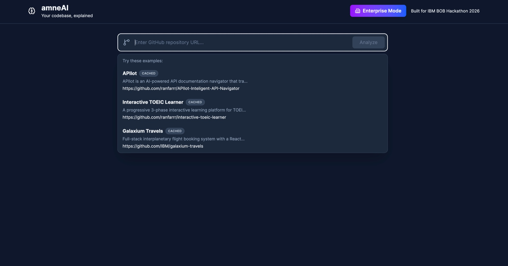
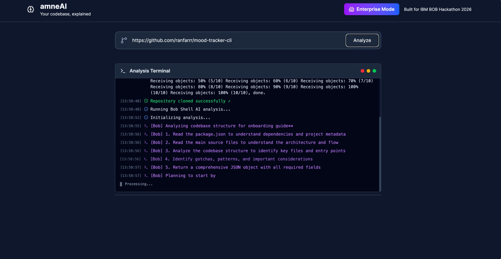
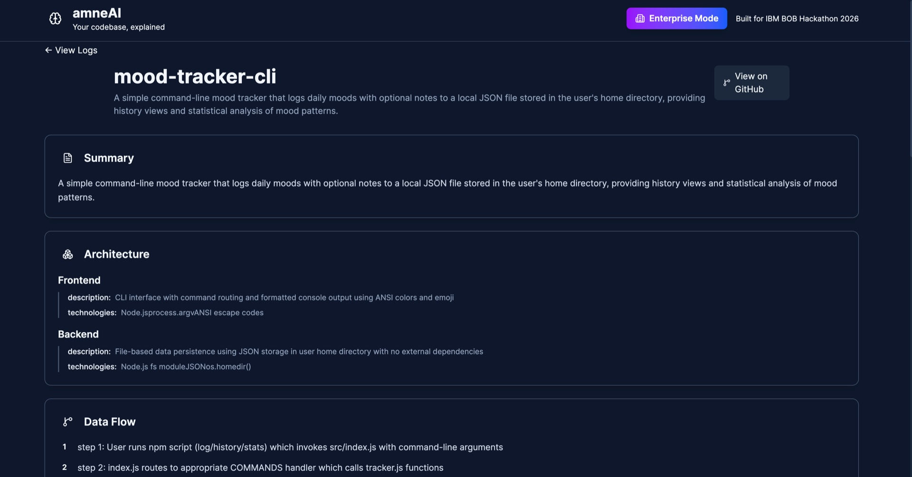
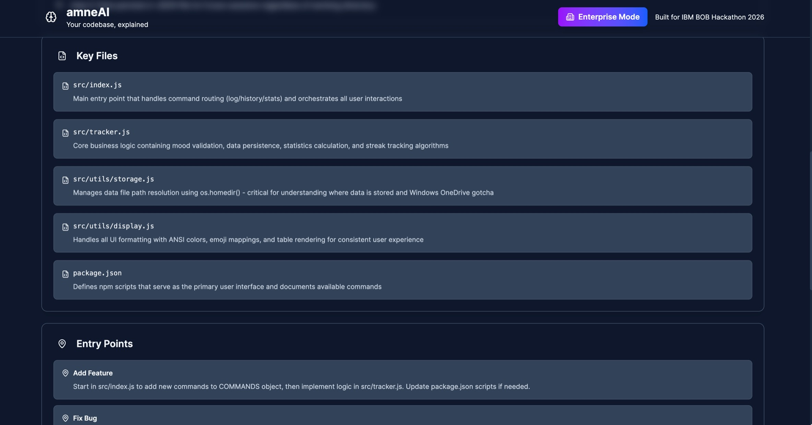
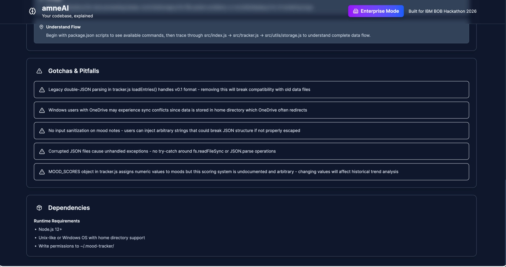

# amneAI — Your Codebase, Explained.

### A cure for codebase amnesia.

**Built for IBM Bob Hackathon 2026 at lablab.ai**

> _"I built a website with AI. It works perfectly. But when my friend asked me to modify it — I couldn't explain my own code."_

amneAI turns any GitHub repository into a structured, plain-English codebase guide — so you actually understand what's in your code.

## 🎬 See It In Action

**1. Paste any GitHub URL**


**2. Watch IBM Bob Shell analyze the entire repo in real-time**


**3. Get a structured, interactive codebase guide**






---

## 🎯 What is amneAI?

Paste a GitHub URL. Get a 7-section interactive dashboard that explains your codebase in human-readable language:

| Section | What You Learn |
|---------|---------------|
| 📋 **Summary** | What does this app actually do? |
| 🏗️ **Architecture** | What are the main parts and how do they connect? |
| 🔀 **Data Flow** | How does information move through the app? |
| 📖 **Key Files** | Which files should I read first? |
| 🚀 **Entry Points** | I want to add a feature — where do I start? |
| ⚠️ **Gotchas** | What will confuse me? (And why it exists) |
| 🔌 **Dependencies** | What does this app need to run? |

**Zero jargon. Instant understanding.**

## 💡 Why amneAI?

- **73% of new code is AI-generated** (GitHub, 2025) — developers build faster than they can understand
- You can't Google something you don't know exists — amneAI asks the right questions for you
- Unlike chat responses that disappear, amneAI gives you a **persistent, shareable guide**

## 🏗️ Architecture

```
┌─────────────────────────────────────────────────────────┐
│                     User Interface                       │
│  (React 19 + Vite 8 + Tailwind CSS 4 + Lucide Icons)   │
└─────────────────────────────────────────────────────────┘
                           │
                           ▼
              ┌────────────┴────────────┐
              │                         │
              ▼                         ▼
    ┌─────────────────┐      ┌─────────────────┐
    │  Production     │      │  Local Mode     │
    │  (Static Site)  │      │  (Backend API)  │
    └─────────────────┘      └─────────────────┘
              │                         │
              │                         ▼
              │              ┌─────────────────┐
              │              │  Express Server │
              │              │  (Port 3001)    │
              │              └─────────────────┘
              │                         │
              │                         ▼
              │              ┌─────────────────┐
              │              │  Git Clone Repo │
              │              └─────────────────┘
              │                         │
              │                         ▼
              │              ┌─────────────────┐
              │              │  IBM Bob Shell  │
              │              │  (bob -p)       │
              │              └─────────────────┘
              │                         │
              └─────────────┬───────────┘
                            ▼
              ┌─────────────────────────┐
              │  Interactive Dashboard  │
              │  (7 Card Components)    │
              └─────────────────────────┘
```

**How it works:**
1. **Clone** — Express backend clones the GitHub repository
2. **Analyze** — IBM Bob Shell reads every file with full context awareness via `bob -p`
3. **Render** — React dashboard displays the structured codebase guide via SSE streaming

Unlike standard RAG, Bob Shell processes the **entire** repository architecture natively — no chunking, no embedding, no retrieval loss.

## 🚀 Quick Start

### Prerequisites
- **Node.js 18+** — for running the amneAI app
- **npm**
- **IBM Bob Shell** — for live repo analysis (requires **Node.js 22.15.0+**)

> ⚠️ **Note:** IBM Bob Shell requires **Node.js 22.15.0 or later**, which is higher than the app's own requirement. Make sure your Node.js version satisfies Bob Shell's minimum.

### Install IBM Bob Shell

**macOS / Linux:**
```bash
curl -fsSL https://bob.ibm.com/download/bobshell.sh | bash
```

**Windows:**
```powershell
powershell -ep Bypass 'irm -Uri "https://bob.ibm.com/download/bobshell.ps1" | iex'
```

After installation, authenticate with your IBMid when prompted.

### Install amneAI

```bash
git clone https://github.com/ranfarrr/amneai.git
cd amneai
npm install
```

**Option A: Frontend Only (Pre-cached Examples)**
```bash
npm run dev
```
Visit http://localhost:3000

**Option B: Full Stack (Live Analysis)**
```bash
# Terminal 1: Start frontend
npm run dev

# Terminal 2: Start backend
npm run server
```

---

## 🔒 Enterprise Mode — Analyze Private Repos

Enterprise Mode is for users who prioritize **data privacy and security**. Your codebase never leaves your computer — it's only analyzed by IBM Bob's server.

### Option 1: Bob Shell (Recommended)

Your code stays on your machine. Only the analysis request goes to IBM Bob.

**Step 1 — Navigate to your repo:**
```bash
cd /path/to/your/repository
```

**Step 2 — Run the analysis:**
```bash
bob -p "Analyze this codebase and provide a comprehensive codebase guide.
Return ONLY a valid JSON object with no additional text, markdown fences, or explanation.

Required structure:
{
  \"metadata\": {
    \"repoName\": \"repository name\",
    \"repoUrl\": \"github url or local path\",
    \"analyzedAt\": \"ISO timestamp\",
    \"language\": \"primary language\",
    \"framework\": \"main framework\"
  },
  \"summary\": \"1-2 sentence description of what this project does\",
  \"architecture\": {
    \"frontend\": { \"description\": \"...\", \"technologies\": [] },
    \"backend\": { \"description\": \"...\", \"technologies\": [] }
  },
  \"dataFlow\": [\"step 1: user action\", \"step 2: system response\", \"step 3: data processing\"],
  \"keyFiles\": [
    { \"file\": \"path/to/file\", \"reason\": \"why this file is important\" }
  ],
  \"entryPoints\": {
    \"add_feature\": \"where to start when adding a feature\",
    \"fix_bug\": \"where to start when fixing a bug\",
    \"understand_flow\": \"where to start to understand the application flow\"
  },
  \"gotchas\": [\"pitfall 1\", \"pitfall 2\", \"confusing aspect 3\"],
  \"dependencies\": {
    \"external_services\": [\"service1\", \"service2\"],
    \"npm_packages\": { \"package\": \"purpose\" },
    \"runtime_requirements\": [\"Node.js 18+\", \"etc\"]
  }
}

Include exactly 5 keyFiles. Focus on helping developers understand the codebase quickly.
Pay special attention to the gotchas section - include security concerns, technical debt, and confusing patterns." > analysis.json
```

This generates an `analysis.json` file in your repository that matches amneAI's dashboard format.

### Option 2: Run amneAI Locally

For the full experience with live analysis and the interactive dashboard:

```bash
git clone https://github.com/ranfarrr/amneai
cd amneai
npm install
npm run dev:full
```

> 📌 **Coming soon:** JSON upload feature so you can view any `analysis.json` in the amneAI dashboard without a backend.

---

## 🎨 Tech Stack

| Layer | Technology |
|-------|-----------|
| **Frontend** | React 19 + Vite 8 + Tailwind CSS 4 + Lucide Icons |
| **Backend** | Express.js + Server-Sent Events (SSE) |
| **AI Engine** | IBM Bob Shell (`bob -p` — full repo context analysis) |
| **Built With** | IBM Bob IDE (Enterprise Plan) |

> **Note:** All code for this project was written using IBM Bob IDE during the hackathon. Bob task session reports are included in the `bob_sessions/` directory.

## 📊 Pre-cached Examples

| Project | Stack | Repository |
|---------|-------|-----------|
| **APIlot** | React + Vite + n8n + Firecrawl + vLLM | [ranfarrr/APIlot-Inteligent-API-Navigator](https://github.com/ranfarrr/APIlot-Inteligent-API-Navigator) |
| **Interactive TOEIC Learner** | React 18 + Vite + Tailwind | [ranfarrr/interactive-toeic-learner](https://github.com/ranfarrr/interactive-toeic-learner) |
| **Galaxium Travels** | FastAPI + React + TypeScript + SQLite | [IBM/galaxium-travels](https://github.com/IBM/galaxium-travels) |

## 📁 Project Structure

```
amneai/
├── src/
│   ├── components/
│   │   ├── layout/Header.jsx
│   │   ├── cards/          # 7 analysis section cards
│   │   ├── modals/EnterpriseModal.jsx
│   │   ├── RepoInput.jsx
│   │   └── TerminalDisplay.jsx
│   ├── data/               # Pre-cached analysis JSONs
│   ├── hooks/useEnvironment.js
│   ├── utils/
│   ├── App.jsx
│   └── index.css
├── server.js               # Express backend + Bob Shell integration
├── bob_sessions/           # IBM Bob task reports (required for judging)
└── package.json
```

## 🔧 Environment Variables

```env
# Backend (.env)
PORT=3001
CORS_ORIGINS=http://localhost:3000
NODE_ENV=development
```

## 🏆 Hackathon Submission

**IBM Bob Hackathon 2026 — lablab.ai**

### The Problem
AI lets anyone build software. AI doesn't help you **understand** what you built. The gap between what we build and what we understand is growing every day.

### The Solution
amneAI uses IBM Bob Shell to analyze entire repositories with full context awareness and generate structured, plain-English codebase guides — so developers can recover understanding of code they've lost context on.

### IBM Bob Usage
- **IBM Bob IDE** — Used to write, debug, and orchestrate the entire application
- **IBM Bob Shell** — Powers the backend analysis engine (`bob -p`) that reads repositories

### Key Features
- ✅ Instant codebase analysis of any GitHub repository
- ✅ 7 comprehensive analysis sections in plain English
- ✅ Real-time SSE streaming with live terminal output
- ✅ Pre-cached examples for instant demonstration
- ✅ Beautiful, animated dark-theme dashboard

## 📝 License

MIT License

## 👨‍💻 Author

**Randy Faraday** — [@ranfarrr](https://github.com/ranfarrr)

Built solo in 48 hours. Powered by IBM Bob.

---

**Made with ❤️ using IBM Bob IDE + IBM Bob Shell**