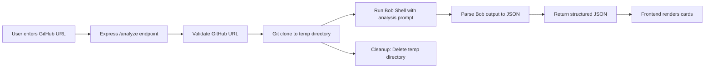

# amneAI Technical Specification

## 🎯 Project Overview
**amneAI** - AI-powered codebase onboarding tool that transforms GitHub repositories into interactive, beautiful onboarding dashboards.

**Target**: IBM BOB Hackathon 2026 at lablab.ai (24-hour timeline)

---

## 🏗️ Architecture Strategy

### Deployment Modes

#### **Mode 1: Production (Deployed Site)**
- **Pre-cached JSON files** for instant demo
- **Card gallery** - Click to load cached analysis
- **Enterprise Modal** - Shows "run locally" instructions when URL input is attempted
- **Zero backend** - Pure static site (Vercel/Netlify)

#### **Mode 2: Local Demo (Video Recording)**
- **Express backend** running locally
- **Full Bob Shell integration** with git clone
- **Live URL analysis** for impressive demo footage
- **Not deployed** - local-only for video

#### **Mode 3: Enterprise Modal (Production Fallback)**
- Appears when user tries URL input on deployed site
- Shows setup instructions for local installation
- Positions tool as "enterprise-ready" requiring local setup

---

## 🔧 Bob Shell Integration Strategy

### **Yes, Bob Shell MUST clone/pull the repo first!**

Here's the workflow:



### Backend Implementation (Express)

```javascript
// server.js (local only)
const express = require('express');
const { exec } = require('child_process');
const fs = require('fs-extra');
const path = require('path');

app.post('/analyze', async (req, res) => {
  const { repoUrl } = req.body;
  const tempDir = path.join(__dirname, 'temp', Date.now().toString());
  
  try {
    // 1. Clone repo
    await execPromise(`git clone ${repoUrl} ${tempDir}`);
    
    // 2. Run Bob Shell with your prompt (VERIFIED WORKING)
    const bobOutput = await execPromise(
      `cd ${tempDir} && bob -p "Analyze this codebase and provide: summary, architecture, dataFlow, keyFiles, entryPoints, gotchas, dependencies"`
    );
    
    // 3. Parse Bob's output to JSON
    const analysis = parseBobOutput(bobOutput);
    
    // 4. Return JSON
    res.json(analysis);
    
  } catch (error) {
    res.status(500).json({ error: error.message });
  } finally {
    // 5. Cleanup
    await fs.remove(tempDir);
  }
});
```

### Key Considerations

1. **Timeout Handling**: Set 5-minute timeout for large repos
2. **Error Recovery**: Handle clone failures, Bob errors gracefully
3. **Temp Directory**: Use unique timestamps to avoid conflicts
4. **Cleanup**: Always delete temp repos after analysis
5. **Security**: Validate GitHub URLs, prevent command injection

---

## 📊 Data Schema (onboard.json)

Based on your existing APIlot analysis, the schema is:

```typescript
interface OnboardingData {
  metadata?: {
    repoName: string;
    repoUrl: string;
    analyzedAt: string;
    language: string;
    framework: string;
  };
  summary: string;
  architecture: {
    frontend?: object;
    backend?: object;
    [key: string]: any;
  };
  dataFlow: string[];
  keyFiles: Array<{
    file: string;
    reason: string;
  }>;
  entryPoints: {
    [key: string]: string;
  };
  gotchas: string[];
  dependencies: {
    external_services?: string[];
    npm_packages?: object;
    runtime_requirements?: string[];
  };
}
```

---

## 🎨 Frontend Architecture

### Component Structure
```
src/
├── components/
│   ├── layout/
│   │   ├── Header.jsx
│   │   └── Container.jsx
│   ├── gallery/
│   │   ├── CardGallery.jsx
│   │   └── RepoCard.jsx
│   ├── input/
│   │   └── RepoInput.jsx
│   ├── cards/
│   │   ├── BaseCard.jsx
│   │   ├── SummaryCard.jsx
│   │   ├── ArchitectureCard.jsx
│   │   ├── DataFlowCard.jsx
│   │   ├── KeyFilesCard.jsx
│   │   ├── EntryPointsCard.jsx
│   │   ├── GotchasCard.jsx
│   │   └── DependenciesCard.jsx
│   └── modals/
│       └── EnterpriseModal.jsx
├── data/
│   ├── apilot.json
│   ├── toeic-learner.json
│   ├── galaxium-travels.json
│   └── index.js
├── hooks/
│   └── useAnalysisData.js
├── utils/
│   ├── animations.js
│   └── api.js
└── App.jsx
```

### State Management
```javascript
// App.jsx
const [mode, setMode] = useState('gallery'); // 'gallery' | 'analysis'
const [selectedRepo, setSelectedRepo] = useState(null);
const [analysisData, setAnalysisData] = useState(null);
const [loading, setLoading] = useState(false);
const [showEnterpriseModal, setShowEnterpriseModal] = useState(false);
```

### Environment Detection
```javascript
// utils/api.js
const IS_PRODUCTION = import.meta.env.PROD;
const API_URL = IS_PRODUCTION 
  ? null // No backend in production
  : 'http://localhost:3001';

export const analyzeRepo = async (repoUrl) => {
  if (IS_PRODUCTION) {
    // Show enterprise modal instead
    return { showModal: true };
  }
  
  // Local mode: call Express backend
  const response = await fetch(`${API_URL}/analyze`, {
    method: 'POST',
    headers: { 'Content-Type': 'application/json' },
    body: JSON.stringify({ repoUrl })
  });
  
  return response.json();
};
```

---

## 🎯 Pre-cached Examples

### 1. APIlot (Your Project)
- **File**: `src/data/apilot.json`
- **Already exists** in your repomix output
- **Shows**: React + Vite + AI integration, n8n workflow
- **URL**: https://github.com/ranfarrr/APIlot-Inteligent-API-Navigator

### 2. Interactive TOEIC Learner (Your Project)
- **File**: `src/data/toeic-learner.json`
- **Purpose**: Educational app - shows different domain
- **URL**: https://github.com/ranfarrr/interactive-toeic-learner
- **Note**: Need repomix if GitHub fetch fails

### 3. IBM Galaxium Travels (IBM Example)
- **File**: `src/data/galaxium-travels.json`
- **Purpose**: Official IBM demo project for hackathon
- **URL**: https://github.com/IBM/galaxium-travels
- **Highlights**: Enterprise-grade architecture, IBM best practices

---

## 🚀 Build Timeline (24 Hours)

### Phase 1: Foundation (Hours 1-6)
- ✅ Project setup (Vite + React + Tailwind)
- ✅ Create data schema and sample JSONs
- ✅ Build BaseCard component
- ✅ Implement card gallery view

### Phase 2: Core Features (Hours 7-14)
- ✅ All card components (Summary, Architecture, etc.)
- ✅ Animations and transitions
- ✅ RepoInput component
- ✅ Enterprise Modal

### Phase 3: Backend (Hours 15-18)
- ✅ Express server setup
- ✅ Git clone + Bob Shell integration
- ✅ Error handling and cleanup

### Phase 4: Polish & Deploy (Hours 19-24)
- ✅ Responsive design
- ✅ Deploy to Vercel
- ✅ Record demo video
- ✅ Prepare presentation

---

## 🎨 Design System

### Color Palette (Dark Theme)
```javascript
// tailwind.config.js
colors: {
  primary: '#10b981', // emerald-500
  secondary: '#3b82f6', // blue-500
  warning: '#f59e0b', // amber-500
  danger: '#ef4444', // red-500
  bg: {
    primary: '#0f172a', // slate-900
    secondary: '#1e293b', // slate-800
    card: '#334155', // slate-700
  },
  text: {
    primary: '#f1f5f9', // slate-100
    secondary: '#cbd5e1', // slate-300
    muted: '#94a3b8', // slate-400
  }
}
```

### Typography
- **Headings**: font-display (Inter)
- **Body**: font-sans (Inter)
- **Code**: font-mono (Fira Code)

### Animations
```javascript
// Staggered card entrance
cards.forEach((card, index) => {
  card.style.animationDelay = `${index * 100}ms`;
});
```

---

## 🔒 Security Considerations

1. **URL Validation**: Regex check for valid GitHub URLs
2. **Command Injection**: Sanitize all inputs before shell execution
3. **Rate Limiting**: Limit analysis requests (local mode)
4. **Temp Directory**: Use secure random names, cleanup always
5. **Error Messages**: Don't expose system paths in production

---

## 📝 Prompt Engineering (Your Responsibility)

You'll create the Bob Shell prompt. Suggested structure:

```
Analyze this codebase and provide a comprehensive onboarding guide in JSON format with these sections:

1. summary: Brief description of what the project does
2. architecture: Key components and their responsibilities
3. dataFlow: Step-by-step user/data flow through the system
4. keyFiles: 5 most important files with reasons
5. entryPoints: Where to start for common tasks (add feature, fix bug, etc.)
6. gotchas: Confusing aspects, technical debt, or pitfalls
7. dependencies: External services, packages, runtime requirements

Focus on helping new developers understand the codebase quickly.
```

---

## ✅ Success Criteria

### Must Have (MVP)
- ✅ Card gallery with 2-3 pre-cached examples
- ✅ Beautiful, animated card UI
- ✅ Enterprise modal for production
- ✅ Deployed static site

### Should Have (If Time)
- ✅ Local Express backend working
- ✅ Bob Shell integration functional
- ✅ Demo video showing live analysis

### Nice to Have (Stretch)
- ⚠️ Export analysis as PDF
- ⚠️ Search/filter in cards
- ⚠️ Syntax highlighting for code snippets

---

## 🎬 Demo Strategy

### For Judges (Deployed Site)
1. Show card gallery with pre-cached examples
2. Click APIlot card → instant load
3. Explain each section (Summary, Architecture, etc.)
4. Click URL input → Enterprise modal appears
5. Explain "production-ready, requires local setup"

### For Video (Local Demo)
1. Start with deployed site demo
2. Switch to local environment
3. Paste real GitHub URL (e.g., a trending repo)
4. Show live analysis in progress
5. Display results in beautiful cards
6. Highlight security findings in Gotchas section

---

## 🚨 Risk Mitigation

| Risk | Mitigation |
|------|------------|
| Bob Shell fails | Pre-cached examples always work |
| Large repo timeout | Set 5-min limit, show error gracefully |
| Deployment issues | Static site = minimal failure points |
| Time overrun | Prioritize Mode 1 (cached), Mode 2 optional |
| JSON parsing errors | Robust error handling + fallbacks |

---

## 📦 Deliverables

1. **Deployed Site** (Vercel) - Production mode with cached examples
2. **GitHub Repo** - Clean, documented code
3. **Demo Video** (3-5 min) - Shows both modes
4. **README.md** - Setup instructions, architecture diagram
5. **Presentation Deck** - Problem, solution, tech stack, demo

---

## 🎯 Next Steps

Ready to build? Here's the order:

1. ✅ **Create sample JSON files** (apilot.json, juice-shop.json)
2. ✅ **Setup React project** (Vite + Tailwind)
3. ✅ **Build card components** (start with BaseCard)
4. ✅ **Implement gallery view**
5. ✅ **Add animations**
6. ✅ **Build Express backend** (if time permits)
7. ✅ **Deploy and record demo**

**Estimated Total Time**: 18-20 hours (leaves 4-6 hours buffer)